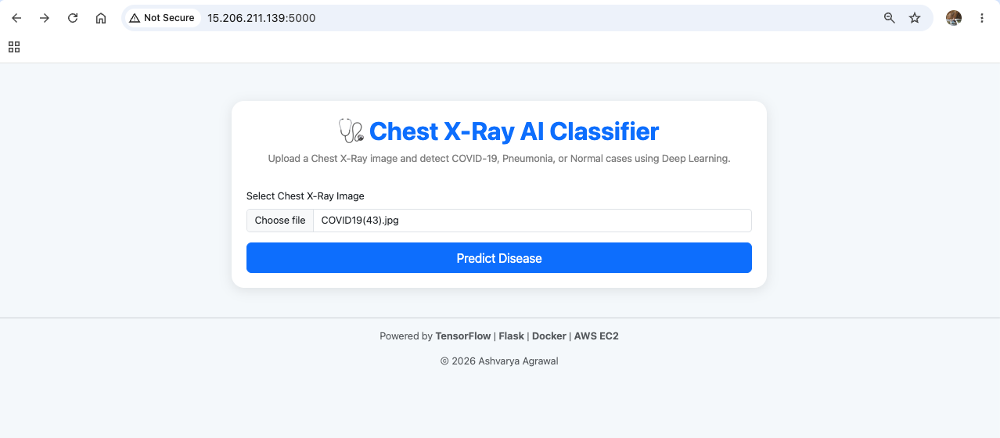
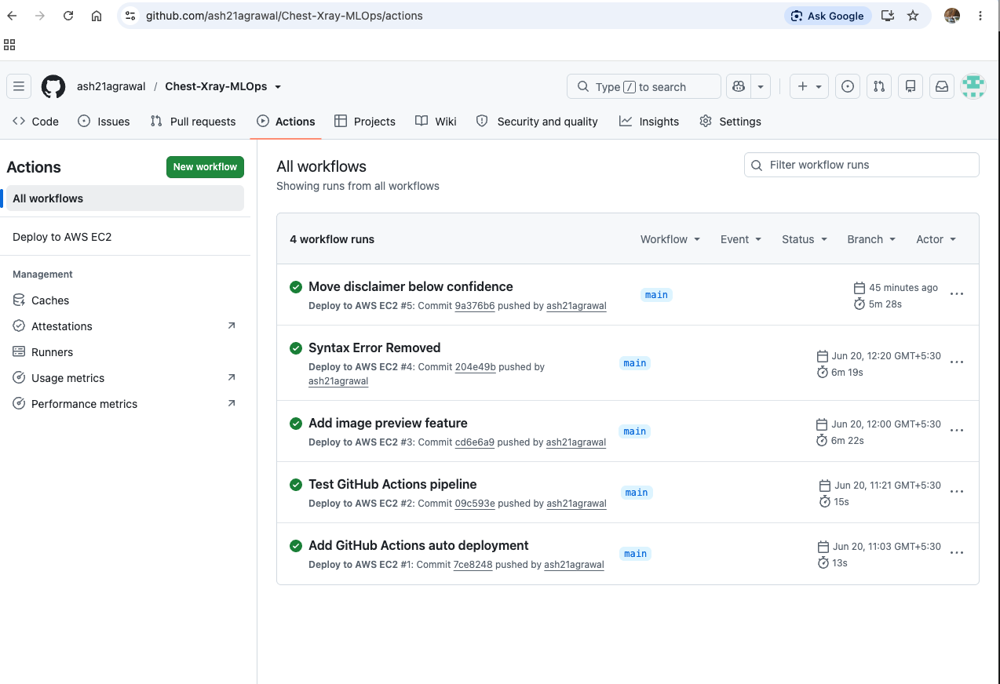

# Chest X-Ray AI Disease Detection System

## Project Overview

This project is a Deep Learning based web application that classifies Chest X-Ray images into three categories:

- COVID-19
- Pneumonia
- Healthy (Normal)

The application is built using TensorFlow and Flask, containerized using Docker, deployed on AWS EC2, and integrated with GitHub Actions for automated CI/CD deployment.

## Dataset

Dataset Used:

COVID-Pneumonia-Normal Chest X-Ray Images Dataset

Classes:

- COVID-19
- Pneumonia
- Healthy

Dataset Distribution:

| Class | Images |
|---------|---------:|
| COVID-19 | 2202 |
| Pneumonia | 5526 |
| Healthy | 3386 |

Total Images: 11,114

## Model Architecture

A Custom Convolutional Neural Network (CNN) was developed using TensorFlow/Keras for multi-class Chest X-Ray image classification.

Architecture:

- Conv2D (32 Filters)
- MaxPooling2D
- Conv2D (64 Filters)
- MaxPooling2D
- Conv2D (128 Filters)
- MaxPooling2D
- Flatten Layer
- Dense Layer (128 Neurons)
- Dropout Layer
- Softmax Output Layer (3 Classes)

Input Image Size: 150 x 150

Total Trainable Parameters: 4,828,741

Classes:

- COVID-19
- Pneumonia
- Healthy

Model Accuracy: 91.10%

## Experimental Models Evaluated

| Model | Accuracy |
|---------|---------:|
| Custom CNN | 91.10% |
| ResNet50 Transfer Learning | 93.08% |

The deployed web application currently uses the Custom CNN model.

## Features

- Chest X-Ray Image Upload
- Real-Time Disease Prediction
- Confidence Score Display
- Uploaded Image Preview
- Responsive User Interface
- Dockerized Deployment
- AWS EC2 Hosting
- GitHub Actions CI/CD
- Automated Deployment Pipeline

## Technology Stack

### Machine Learning

- Python
- TensorFlow
- Keras
- NumPy

### Backend

- Flask

### DevOps / MLOps

- Docker
- Git
- GitHub
- GitHub Actions

### Cloud

- AWS EC2 (Ubuntu)

## Local Setup

Clone Repository:

git clone https://github.com/ash21agrawal/Chest-Xray-MLOps.git

cd Chest-Xray-MLOps

Install Dependencies:

pip install -r requirements.txt

Run Application:

python app.py

Application runs on:

http://127.0.0.1:5000

## Docker Deployment

Build Docker Image:

docker build -t chest-xray-app .

Run Docker Container:

docker run -d -p 5000:5000 chest-xray-app

## AWS Deployment

The application is deployed on:

- AWS EC2
- Ubuntu Linux Server
- Docker Container

The application is publicly accessible through the AWS EC2 public IP address.

## CI/CD Pipeline

GitHub Actions automatically:

1. Detects push to the main branch
2. Connects to AWS EC2 using SSH
3. Pulls the latest source code
4. Rebuilds Docker image
5. Restarts Docker container
6. Deploys the latest application version automatically

This enables fully automated deployment from GitHub to AWS EC2.

## MLOps Highlights

- Docker Containerization
- AWS Cloud Deployment
- GitHub Version Control
- GitHub Actions Automation
- CI/CD Pipeline Integration
- Automated Container Deployment

## Screenshots

### Home Page

### Prediction Result

### GitHub Actions CI/CD

## Future Enhancements

- Domain Name Integration
- HTTPS Security
- Gunicorn Deployment
- Nginx Reverse Proxy
- MLflow Integration
- Model Monitoring
- Input Validation Model (X-Ray vs Non-X-Ray Detection)
- Kubernetes Deployment

## Disclaimer

This application is intended for educational and research purposes only and should not be used as a substitute for professional medical diagnosis.

## Author

**Ashvarya Agrawal**

Mechanical Engineer | Data Science Enthusiast | Machine Learning & MLOps Learner
